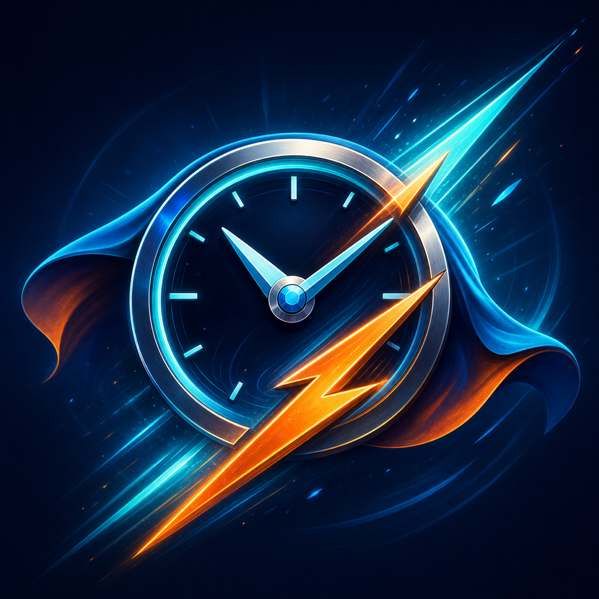
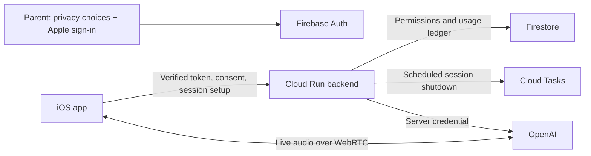

<p align="center">
  
</p>

# ZeitHeld · Time Hero

A playful iPhone and iPad app for learning to read an analog clock, in German
and English. Built as an open-source experiment and shared under the MIT license.

[](https://github.com/appdess/zeitheld/actions/workflows/ci.yml)
[](https://github.com/appdess/zeitheld/actions/workflows/codeql.yml)
[](LICENSE)

**Status:** development beta. Offline learning works without an account or API
key. Hosted online access is restricted to approved adults testing fictional
content. Public child cloud access, App Store release and a public TestFlight
invitation are not available yet. Publishing this source does not enable them.

## Learn, talk, create

- Practice full hours, half hours, quarters, five-minute steps and exact minutes.
- Follow a separate saved learning journey for each child, including correct and
  incorrect answers. Revisit any stage without losing stars or completed stages,
  or reset one journey without removing the others. Half-hour practice always
  shows a half hour before progressing to quarters.
- Use the device language automatically, or choose German/English in Settings.
- Describe an original hero first; optionally pick appearance and scene details.
  Voice entry shows recording, processing and accepted-text feedback.
- Open your saved hero full-screen, zoom, and save or share it. Optionally create
  a printable coloring page of the same hero with a clock; this explicit online
  image edit uses the image allowance and keeps the original intact.
- Optional GPT-Live voice uses native, full-duplex WebRTC. A short first
  conversation asks about familiarity with clocks and numbers; local code grades
  clock answers. AI responses can be wrong and need adult supervision.
- Review privacy before Apple sign-in. Voice and Hero Lab have separate optional
  permissions, a versioned account receipt, and withdrawal in Settings.

There are no advertisements or Firebase Analytics. Apple/Firebase authentication
is used for the optional managed parent account. Read [PRIVACY.md](PRIVACY.md)
and [TERMS.md](TERMS.md) for the actual beta boundaries.

## Run offline

Use Xcode 26.2 or newer, Swift 6, and iOS/iPadOS 17 or newer. Generate the project
before opening it; local Firebase configuration is deliberately not distributed.

```bash
./Scripts/install-xcodegen.sh
.tools/xcodegen/bin/xcodegen generate
open WatchLearn.xcodeproj
```

Choose the `WatchLearn` scheme and an iPhone Simulator. A new checkout has no
managed endpoint or credentials and runs offline. To install on a phone, select
your own Apple signing team and bundle identifier.

## Configure your own online service

The reusable OpenAI key belongs in the backend's secret manager, never in the
app or repository. The iOS client receives a bounded session connection, while
continuous audio travels directly between the device and OpenAI.



1. Configure your own Firebase iOS app and Apple sign-in provider. Download its
   `GoogleService-Info.plist` into `WatchLearn/Resources/` (git-ignored).
2. Deploy the Node backend using [Backend/README.md](Backend/README.md).
3. Create an ignored root `Secrets.xcconfig` with your service URL:

   ```xcconfig
   ZEITHELD_SERVICE_URL = https:/$()/your-service.example.com
   ```

4. Regenerate the Xcode project, build, and review privacy before signing in.

The unusual URL spelling avoids xcconfig treating `//` as a comment. Firebase
client configuration is public configuration rather than an administrator secret;
we omit the maintainer's configuration so forks do not target the hosted service.

Settings offers two ways to try the online features, in Debug and Release builds:

- **Sign in with Apple:** one five-minute voice trial per Apple account, shared
  across devices and child profiles. Existing consumed time is preserved; there
  are no automatic charges. Hosted access remains subject to the beta gate above.
- **Bring your own API key:** no Apple sign-in required. Add your OpenAI key in
  Settings, then review privacy and enable the desired features. The key stays in
  the device-only Keychain, is not synchronized from the Mac and is sent directly
  to OpenAI, never to the ZeitHeld backend. OpenAI bills this usage separately.

The API-key route uses the native OpenAI Live endpoint. To run your own ZeitHeld
backend instead, configure its HTTPS service URL in `Secrets.xcconfig` as above;
that backend requires its own matching Firebase and Apple sign-in configuration.

## Tests and security

[TESTING.md](TESTING.md) explains deterministic Simulator tests and opt-in live
checks. Paid tests are disabled in normal CI. The backend has unit tests and an
explicit, isolated Firestore transaction check.

```bash
cd Backend
npm ci
npm test
npm audit --omit=dev
```

Read [SECURITY.md](SECURITY.md) before deploying or releasing. A source audit,
passing tests or an acceptance checkbox is not a guarantee of security, valid
parental authorization or legal compliance. Operator details, provider retention,
child privacy, store disclosures and release controls still need verification.

## Feedback and contributions

Found a bug or have a learning idea? [Open a GitHub issue](https://github.com/appdess/zeitheld/issues/new/choose).
Do not include children's names, recordings, transcripts, credentials or other
private information. Report security issues through
[private vulnerability reporting](https://github.com/appdess/zeitheld/security/advisories/new).

GitHub can email issue notifications and accept replies to an existing thread.
A private support mailbox is a separate service; no automatic email-to-public-
issue forwarding is configured. See [CONTRIBUTING.md](CONTRIBUTING.md).

## License

[MIT](LICENSE) for the application source and original bundled project assets;
see [ASSET_PROVENANCE.md](ASSET_PROVENANCE.md).
Dependencies are fetched through the pinned Swift/npm manifests and retain their
own licenses.
Hosted beta terms, provider services and third-party licenses apply separately.
This is a personal project, not an official OpenAI product.
